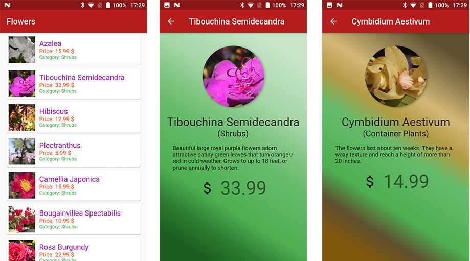

# flutter_app_testing

A flutter app to demonstrate testing.

## What does the app do?
This app will load list of different 'Plant's information from local JSON file stored in assets directory and show them in a list. On clicking any list item, detail screen will be shown. This app is designed to demonstrate different types of test coverages. 

## Types of Tests Included

- Unit Tests
- Widget Tests
- Integration Tests

## Getting Started

This project is a starting point for a Flutter application.

A few resources to get you started if this is your first Flutter project:

- [Lab: Write your first Flutter app](https://flutter.dev/docs/get-started/codelab)
- [Cookbook: Useful Flutter samples](https://flutter.dev/docs/cookbook)

For help getting started with Flutter, view our 
[online documentation](https://flutter.dev/docs), which offers tutorials, 
samples, guidance on mobile development, and a full API reference.
